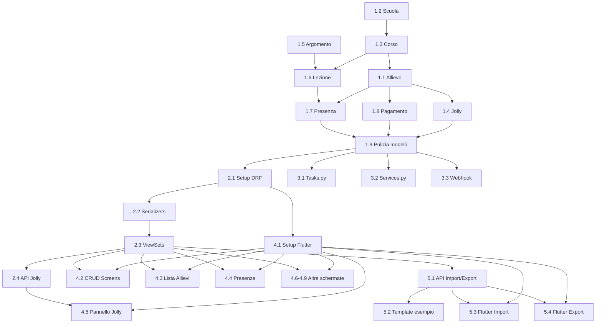

# 📋 WAManager v2 — Backlog Modifiche

> **Stato:** Draft
> **Data:** 2026-09-26

---

## Legenda Stime

| Tag | Significato |
|-----|-------------|
| 🟢 S | Small — ~1-2h |
| 🟡 M | Medium — ~3-5h |
| 🔴 L | Large — ~6-10h |
| ⚫ XL | Extra Large — ~10-20h |

---

## Fase 1 — Modelli Dati (Backend Django) ✅ COMPLETATA

### 1.1 🟡 M — Modifica anagrafica allievo (Participant → Allievo) ✅ [COMPLETATO]
**Stima:** ~3h

Rinominare il modello `Participant` in `Allievo` e adattare i campi:

| Campo attuale | Azione | Campo nuovo |
|--------------|--------|-------------|
| `first_name` | Rinomina | `nome` |
| `last_name` | Rinomina | `cognome` |
| `role` | Mantieni | `ruolo` (leader/follower/both) |
| `phone_number` | Rinomina | `telefono` |
| `level` | Mantieni | `livello` (principiante/intermedio/avanzato) |
| `gender` | **Rimuovi** | — |
| `is_active` | Mantieni | `is_active` |
| `privacy_accepted_at` | **Rimuovi** | — |
| — | **Aggiungi** | `corso` (FK → Corso, nullable) |
| — | **Aggiungi** | `recensione` (enum: Sì/No) |
| — | **Aggiungi** | `is_prospect` (bool, default False) |
| — | **Aggiungi** | `note` (TextField, per prospect) |

**File coinvolti:** `models.py`, `admin.py`, migrazione, `views.py` (aggiornare import), `services.py`, `tasks.py`

**Dipendenze:** Richiede 1.3 (Corso) prima di aggiungere FK

---

### 1.2 🟢 S — Nuova anagrafica Scuola ✅ [COMPLETATO]
**Stima:** ~1h

Nuovo modello `Scuola`:
- `id` (UUID PK)
- `nome` (CharField)
- `sede` (CharField)
- `gruppo_whatsapp` (CharField, opzionale)

**File coinvolti:** `models.py`, `admin.py`, migrazione

**Dipendenze:** Nessuna (va fatto per primo)

---

### 1.3 🟢 S — Nuova anagrafica Corso ✅ [COMPLETATO]
**Stima:** ~1h

Nuovo modello `Corso`:
- `id` (UUID PK)
- `livello` (enum: principiante/intermedio/avanzato)
- `orario` (TimeField)
- `scuola` (FK → Scuola)
- `anno_accademico` (CharField, es. "2025/2026")
- `gruppo_whatsapp` (CharField, opzionale)

**File coinvolti:** `models.py`, `admin.py`, migrazione

**Dipendenze:** 1.2 (Scuola)

---

### 1.4 🟢 S — Nuova anagrafica Jolly ✅ [COMPLETATO]
**Stima:** ~1h

Nuovo modello `Jolly`:
- `id` (UUID PK)
- `allievo` (FK → Allievo)
- `priorita` (PositiveIntegerField, 1=più alta)

**File coinvolti:** `models.py`, `admin.py`, migrazione

**Dipendenze:** 1.1 (Allievo)

---

### 1.5 🟢 S — Nuova anagrafica Argomento ✅ [COMPLETATO]
**Stima:** ~1h

Nuovo modello `Argomento`:
- `id` (UUID PK)
- `titolo` (CharField)
- `descrizione` (TextField)
- `livello` (enum: principiante/intermedio/avanzato)

**File coinvolti:** `models.py`, `admin.py`, migrazione

**Dipendenze:** Nessuna

---

### 1.6 🟡 M — Nuova anagrafica Lezione ✅ [COMPLETATO]
**Stima:** ~2-3h

Nuovo modello `Lezione` (sostituisce/semplifica `Event`):
- `id` (UUID PK)
- `corso` (FK → Corso)
- `data` (DateField)
- `argomento` (FK → Argomento, nullable)

Adattare i modelli che referenziano `Event`:
- `MessageLog.event` → `MessageLog.lezione`
- `Match.event` → `Match.lezione`
- Rimuovere `EventAttendance` (sostituito da `Presenza`)

**File coinvolti:** `models.py`, `admin.py`, migrazione, `tasks.py`, `services.py`, `views.py`

**Dipendenze:** 1.3 (Corso), 1.5 (Argomento)

---

### 1.7 🟢 S — Nuova tabella Presenza ✅ [COMPLETATO]
**Stima:** ~1h

Nuovo modello `Presenza` (sostituisce `EventAttendance`):
- `id` (UUID PK)
- `lezione` (FK → Lezione)
- `allievo` (FK → Allievo)
- `presente` (BooleanField, default False)
- `timestamp` (auto_now_add)
- **Vincolo:** unique_together (lezione, allievo)

**File coinvolti:** `models.py`, `admin.py`, migrazione

**Dipendenze:** 1.1 (Allievo), 1.6 (Lezione)

---

### 1.8 🟢 S — Nuova tabella Pagamento ✅ [COMPLETATO]
**Stima:** ~1h

Nuovo modello `Pagamento`:
- `id` (UUID PK)
- `allievo` (FK → Allievo)
- `corso` (FK → Corso)
- `importo` (DecimalField, default 150.00€)
- `trimestre` (enum: T1/T2/T3)
- `data_pagamento` (DateField)
- `note` (TextField, opzionale)

**File coinvolti:** `models.py`, `admin.py`, migrazione

**Dipendenze:** 1.1 (Allievo), 1.3 (Corso)

---

### 1.9 🟡 M — Pulizia modelli obsoleti ✅ [COMPLETATO]
**Stima:** ~2-3h

Rimuovere/sostituire modelli vecchi:
- `Event` → sostituito da `Lezione`
- `EventAttendance` → sostituito da `Presenza`
- `Gender` enum → rimosso
- `AttendanceStatus` enum → rimosso (booleano presente/assente)
- Adattare `RecurringSchedule` → aggiungere FK opzionale a `Corso`

**File coinvolti:** `models.py`, `admin.py`, migrazione, tutti i file che importano i vecchi modelli

**Dipendenze:** 1.1-1.7 completati

---

## Fase 2 — API REST (Django REST Framework) ✅ COMPLETATA

### 2.1 🟡 M — Setup DRF e autenticazione ✅ [COMPLETATO]
**Stima:** ~2h

- Installare `djangorestframework` e `django-filter`
- Aggiungere a `INSTALLED_APPS`
- Configurare Token Authentication per il client Flutter
- Endpoint login/logout API (`/api/auth/login/`, `/api/auth/logout/`, `/api/auth/user/`)

**File coinvolti:** `requirements.txt`, `settings.py`, `wamanager/urls.py`

**Dipendenze:** Nessuna

---

### 2.2 🟡 M — Serializers per tutti i modelli ✅ [COMPLETATO]
**Stima:** ~3h

Creare `core/serializers.py` con serializer per:
- `ScuolaSerializer`
- `CorsoSerializer` (con nested scuola)
- `ArgomentoSerializer`
- `AllievoSerializer` (con filtro prospect)
- `JollySerializer`
- `LezioneSerializer` (con nested corso)
- `PresenzaSerializer`
- `PagamentoSerializer`
- `MessageTemplateSerializer`
- `MessageLogSerializer`
- `MatchSerializer`
- `RecurringScheduleSerializer`

**File coinvolti:** nuovo `core/serializers.py`

**Dipendenze:** Fase 1 completata

---

### 2.3 🟡 M — ViewSets e routing API ✅ [COMPLETATO]
**Stima:** ~4h

Creare `core/api_views.py` con ViewSet per ogni modello:

| ViewSet | Filtri speciali / Actions |
|---------|---------------------------|
| `ScuolaViewSet` | Ricerca per nome/sede |
| `CorsoViewSet` | Filtro per scuola, livello, anno_accademico |
| `AllievoViewSet` | Filtro per scuola, corso, is_prospect, ruolo; action `prospects` e `convert_to_student` |
| `JollyViewSet` | Ordinamento per priorità |
| `LezioneViewSet` | Filtro per corso, argomento, data; action `presenze` e `init_presenze` |
| `PresenzaViewSet` | Filtro per lezione, allievo, presente; action `batch_update` |
| `PagamentoViewSet` | Filtro per corso, scuola, trimestre |
| `MatchViewSet` | Filtro per lezione; action `generate` |
| `MessageTemplateViewSet` | CRUD template |
| `MessageLogViewSet` | Log invii |
| `RecurringScheduleViewSet` | Schedulazione ricorrente |

Aggiornare `core/urls.py` con DRF Router.

**File coinvolti:** nuovo `core/api_views.py`, `core/urls.py`

**Dipendenze:** 2.1, 2.2

---

### 2.4 🟢 S — Endpoint invio messaggi Jolly ✅ [COMPLETATO]
**Stima:** ~2h

API dedicata POST `/api/jolly/send-message/`:
- Input: testo, lista lezione_ids, lista jolly_ids O num_jolly
- Output: risultato invio per ogni jolly contattato
- Integrazione con `wa_client.py`

**File coinvolti:** `api_views.py`, `core/urls.py`

**Dipendenze:** 2.3, 1.4

---

## Fase 3 — Adattamento Logica WhatsApp ✅ COMPLETATA

### 3.1 🟡 M — Aggiornare tasks.py per nuovi modelli ✅ [COMPLETATO]
**Stima:** ~4h

- `scheduled_rsvp_announcement()` → lavora con `Lezione` e `Corso` invece di `Event` (supporto POLL e LLM)
- `scheduled_match_announcement()` → usa `Presenza` e `Allievo` invece di `EventAttendance`/`Participant`
- `auto_generate_events()` e `auto_generate_lezioni()` → genera `Lezione` per ogni `Corso` in base a `RecurringSchedule`
- Invio sondaggi al `gruppo_whatsapp` del Corso

**File coinvolti:** `tasks.py`

**Dipendenze:** Fase 1 completata

---

### 3.2 🟡 M — Aggiornare services.py (matching coppie) ✅ [COMPLETATO]
**Stima:** ~2h

- `generate_matches(event_id)` → `generate_matches(lezione_id)`
- Usa `Allievo.ruolo` (leader, follower, both)
- Storico ripetizioni sulle ultime 3 lezioni dello stesso corso
- Rimosso vincolo genere (matching basato su ruolo, rotazione per spaiati)

**File coinvolti:** `services.py`

**Dipendenze:** Fase 1 completata

---

### 3.3 🟢 S — Aggiornare webhook voti sondaggi ✅ [COMPLETATO]
**Stima:** ~1-2h

- `poll_vote_webhook()` → aggiorna `Presenza` per la prossima `Lezione` del corso dell'allievo
- Matching numero telefono su `Allievo.telefono`

**File coinvolti:** `views.py`

**Dipendenze:** 1.1, 1.5, 1.6

---

## Fase 4 — Client Flutter ✅ COMPLETATA

### 4.1 🟡 M — Setup progetto Flutter ✅ [COMPLETATO]
**Stima:** ~3h

- Creare progetto `flutter_app/` (pubspec.yaml, main.dart, models, services)
- Configurare HTTP client `ApiService` con Token Auth Django
- Schermata login `LoginScreen` con salvataggio token e configurazione endpoint
- Navigazione principale responsive `HomeScreen` (NavigationRail per desktop, BottomNav + Drawer per mobile)

**File coinvolti:** `flutter_app/pubspec.yaml`, `flutter_app/lib/main.dart`, `flutter_app/lib/services/api_service.dart`, `flutter_app/lib/screens/login_screen.dart`, `flutter_app/lib/screens/home_screen.dart`

**Dipendenze:** 2.1 (auth API disponibile)

---

### 4.2 🟡 M — Schermate CRUD inserimento (9a) ✅ [COMPLETATO]
**Stima:** ~5h

Form di inserimento/modifica per:
- Scuola (nome, sede, gruppo WA)
- Corso (livello, orario, scuola, anno accademico, gruppo WA)
- Argomento (titolo, descrizione, livello)
- Jolly (allievo dropdown, priorità)

**File coinvolti:** `flutter_app/lib/screens/crud_screen.dart`

**Dipendenze:** 4.1, Fase 2 completata

---

### 4.3 🟡 M — Elenco allievi raggruppabile (9b) ✅ [COMPLETATO]
**Stima:** ~3h

- Lista allievi con ricerca in tempo reale
- Raggruppamento per Scuola o per Corso (toggle)
- Badge ruolo (Leader/Follower/Both), livello (Principiante/Intermedio/Avanzato), recensione
- Dialog di inserimento / modifica allievo

**File coinvolti:** `flutter_app/lib/screens/allievi_screen.dart`

**Dipendenze:** 4.1, 2.3

---

### 4.4 🟡 M — Presenze per lezione (9c) ✅ [COMPLETATO]
**Stima:** ~4h

- Selezione lezione (dropdown)
- Inizializzazione presenze con un click
- Griglia allievi del corso con checkbox presenza e avatar di stato
- Salvataggio batch delle presenze
- Generazione abbinamenti coppie (Match) per la lezione

**File coinvolti:** `flutter_app/lib/screens/presenze_screen.dart`

**Dipendenze:** 4.1, 2.3

---

### 4.5 🟡 M — Pannello invio Jolly (9d) ✅ [COMPLETATO]
**Stima:** ~4h

- Campo testo messaggio
- Multi-select lezioni disponibili
- Scelta: "numero di jolly per priorità" OPPURE selezione specifica
- Pulsante invio con resoconto dettagliato esito per ogni jolly

**File coinvolti:** `flutter_app/lib/screens/jolly_panel_screen.dart`

**Dipendenze:** 4.1, 2.4

---

### 4.6 🟢 S — Inserimento pagamenti (9e) ✅ [COMPLETATO]
**Stima:** ~2h

- Form: allievo, corso, trimestre (T1, T2, T3), importo (precompilato 150€), data, note

**File coinvolti:** `flutter_app/lib/screens/pagamenti_screen.dart`

**Dipendenze:** 4.1, 2.3

---

### 4.7 🟡 M — Consultazione pagamenti (9f) ✅ [COMPLETATO]
**Stima:** ~3h

- Tabella pagamenti con filtri per:
  - Per Corso
  - Per Scuola
  - Per Trimestre
- Calcolo totale incassato dinamico

**File coinvolti:** `flutter_app/lib/screens/pagamenti_screen.dart`

**Dipendenze:** 4.1, 2.3

---

### 4.8 🟢 S — Inserimento e consultazione lezioni (9g, 9h) ✅ [COMPLETATO]
**Stima:** ~2h

- Form inserimento: corso + data + argomento opzionale
- Lista lezioni con contatore presenze totali e presenti
- Scorciatoia rapida per andare alla gestione presenze

**File coinvolti:** `flutter_app/lib/screens/lezioni_screen.dart`

**Dipendenze:** 4.1, 2.3

---

### 4.9 🟢 S — Inserimento prospect (9i) ✅ [COMPLETATO]
**Stima:** ~2h

- Form con campi allievo, senza corso, con campo note
- Elenco prospect registrati
- Pulsante "Iscrivi a Corso" con conversione automatica da prospect ad allievo effettivo

**File coinvolti:** `flutter_app/lib/screens/prospects_screen.dart`

**Dipendenze:** 4.1, 2.3

---

## Fase 5 — Import / Export Dati ✅ COMPLETATA

### 5.1 🟡 M — API backend import/export (CSV, Excel) ✅ [COMPLETATO]
**Stima:** ~4h

Endpoint REST per import ed export dati in formato CSV e Excel (`.xlsx` con `openpyxl`):

| Endpoint | Metodo | Descrizione |
|----------|--------|-------------|
| `/api/export/allievi/` | GET | Esporta allievi in CSV o Excel (filtri scuola/corso/prospect) |
| `/api/export/presenze/` | GET | Esporta presenze in CSV o Excel (filtri lezione/corso) |
| `/api/export/pagamenti/` | GET | Esporta pagamenti in CSV o Excel (filtri scuola/corso/trimestre) |
| `/api/export/lezioni/` | GET | Esporta lezioni in CSV o Excel |
| `/api/import/allievi/` | POST | Import allievi da file CSV/Excel con update_or_create |
| `/api/import/presenze/` | POST | Import presenze da file CSV/Excel con match lezione e allievo |
| `/api/import/pagamenti/` | POST | Import pagamenti da file CSV/Excel con validazione |

**File coinvolti:** `core/import_export.py`, `core/urls.py`, `requirements.txt`

**Dipendenze:** Fase 1, 2.3

---

### 5.2 🟢 S — Template CSV/Excel di esempio per import ✅ [COMPLETATO]
**Stima:** ~1h

Endpoint GET `/api/import/template/<modello>/?format=xlsx|csv` che restituisce file con le colonne esatte e righe di esempio precompilate per Allievi, Presenze, Pagamenti.

**File coinvolti:** `core/import_export.py`, `core/urls.py`

**Dipendenze:** 5.1

---

### 5.3 🟡 M — Schermata Flutter Import dati ✅ [COMPLETATO]
**Stima:** ~3h

- Selezione tipo dato (Allievi, Presenze, Pagamenti)
- Download template di esempio (Excel o CSV)
- Area inserimento/incolla dati o upload multipart
- Report esito dettagliato: creati, aggiornati, errori per riga

**File coinvolti:** `flutter_app/lib/screens/import_export_screen.dart`, `flutter_app/lib/services/api_service.dart`

**Dipendenze:** 4.1, 5.1

---

### 5.4 🟡 M — Schermata Flutter Export dati ✅ [COMPLETATO]
**Stima:** ~3h

- Selezione tipo dato (Allievi, Presenze, Pagamenti, Lezioni)
- Scelta formato: Excel (.xlsx) o CSV (.csv)
- Filtri dinamici per scuola, corso, trimestre
- Generazione ed esportazione file

**File coinvolti:** `flutter_app/lib/screens/import_export_screen.dart`, `flutter_app/lib/services/api_service.dart`

**Dipendenze:** 4.1, 5.1

---

## 📊 Riepilogo Stime (TUTTE LE FASI COMPLETATE)

| Fase | Items | Stima Totale | Stato |
|------|-------|-------------|-------|
| **Fase 1** — Modelli Dati | 9 task | ~14-16h | ✅ COMPLETATA |
| **Fase 2** — API REST | 4 task | ~11-13h | ✅ COMPLETATA |
| **Fase 3** — Logica WhatsApp | 3 task | ~7-8h | ✅ COMPLETATA |
| **Fase 4** — Client Flutter | 9 task | ~28-33h | ✅ COMPLETATA |
| **Fase 5** — Import / Export | 4 task | ~11h | ✅ COMPLETATA |
| | | | |
| **TOTALE PROGETTO** | **29 task** | **~71-81h** | **100% COMPLETATO** |

---

## 📐 Ordine di Esecuzione Consigliato

---

