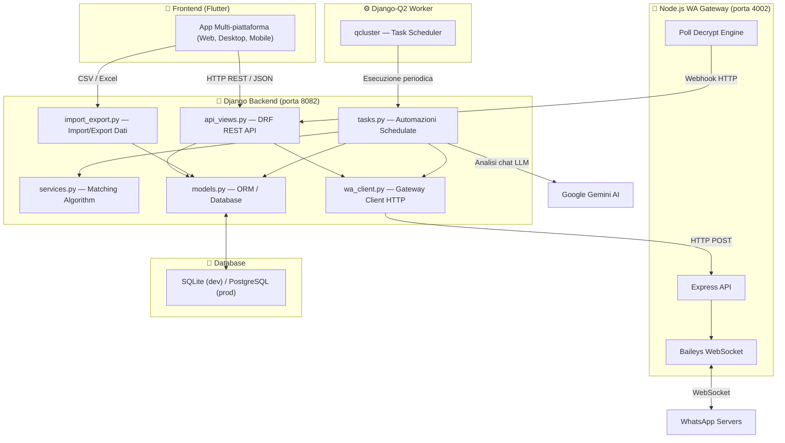

# 🗺️ WAManager — Mappa Progettuale e Funzionale

> **Progetto:** WAManager (Gestione Scuola di Tango)
> **Tipo:** Gestionale per scuola di tango con client Flutter e integrazione WhatsApp
> **Stack:** Django 5 (Backend REST) + Flutter (Client Multi-piattaforma) + Node.js (Gateway WA) + SQLite/PostgreSQL
> **Ultimo aggiornamento mappa:** 2026-09-28

---

## 📐 Architettura ad Alto Livello



---

## 📁 Struttura File del Progetto

```
WAManager/
├── manage.py                          # Entry point Django
├── requirements.txt                   # Dipendenze Python (inclusi DRF, OpenPyXL)
├── flutter_app/                       # Client Flutter
│   ├── lib/
│   │   ├── main.dart                  # Entry point App
│   │   ├── models/                    # Modelli dati Dart
│   │   ├── services/                  # api_service.dart (Client HTTP)
│   │   └── screens/                   # UI Screens (Login, Home, Allievi, Presenze, ecc.)
│   └── pubspec.yaml                   # Dipendenze Dart
│
├── wamanager/                         # Configurazione progetto Django
│   ├── settings.py                    # Settings principale (Auth, DRF)
│   └── urls.py                        # URL routing (include router DRF)
│
├── core/                              # App Django principale
│   ├── models.py                      # Nuovi modelli dati (Scuola, Corso, Allievo, ecc.)
│   ├── serializers.py                 # DRF Serializers per le API
│   ├── api_views.py                   # DRF ViewSets per endpoint API
│   ├── import_export.py               # Endpoint per Import/Export XLSX e CSV
│   ├── urls.py                        # URL router e custom paths
│   ├── admin.py                       # Registrazione modelli Admin
│   ├── services.py                    # Algoritmo matching (adattato)
│   ├── tasks.py                       # Automazioni (WhatsApp e Matching)
│   ├── wa_client.py                   # Client gateway WA
│   └── views.py                       # Webhook e view legacy
│
└── wa-gateway/                        # Microservizio Node.js
    ├── index.js                       # Server Express + Baileys
    └── baileys_store.js               # Store persistenza
```

---

## 🗄️ Modelli Dati (core/models.py)

### Modelli Principali
- **Scuola**: Dati dell'organizzazione.
- **Corso**: I corsi offerti, collegati alla Scuola.
- **Argomento**: Dettagli su cosa si tratta (Titolo, descrizione, livello).
- **Allievo**: Iscritti o prospect (flag `is_prospect`), collegati al Corso. Contiene Ruolo, Livello, Telefono.
- **Jolly**: Persone esterne invitate (followers o leaders).
- **Lezione**: Evento in calendario, collegato a Corso e Argomento.
- **Presenza**: Mapping M2M tra Allievo e Lezione (con status e ruolo specifico per la lezione).
- **Pagamento**: Tracciamento dei pagamenti effettuati dagli Allievi.
- **RecurringSchedule / MessageTemplate / MessageLog / Match**: Modelli di utilità e logica automatizzata.

---

## 🌐 API Endpoints (core/urls.py + core/api_views.py)

Il progetto sfrutta Django REST Framework (DRF) per esporre un'interfaccia standard completa verso il client Flutter.

### Auth & Token
- `POST /api/auth/login/`: Autenticazione (restituisce Token).
- `POST /api/auth/logout/`: Logout.

### Risorse (ViewSets DRF CRUD)
- `/api/scuole/`
- `/api/corsi/`
- `/api/argomenti/`
- `/api/allievi/` (Action `prospects/`, `convert_to_student/`)
- `/api/jolly/` (Action `send-message/`)
- `/api/lezioni/` (Action `init_presenze/`, `generate_matches/`)
- `/api/presenze/` (Action `batch_update/`)
- `/api/pagamenti/`

### Import / Export
- `/api/import-export/export/allievi/` (CSV o XLSX)
- `/api/import-export/export/presenze/`
- `/api/import-export/export/pagamenti/`
- `/api/import-export/export/lezioni/`
- `/api/import-export/import/allievi/`
- `/api/import-export/template/`

### Webhook
- `POST /api/webhook/poll-vote/`: Ricezione voti dei sondaggi WhatsApp dal Gateway Node.js.

---

## 🖥️ Client Flutter (flutter_app)

L'applicazione Flutter funge da frontend principale, interagendo tramite l'APIService con il backend Django.

- **Autenticazione:** Sistema a Token persistito con `shared_preferences`.
- **UI:** Architettura Material 3 responsive (Bottom Nav su mobile, NavigationRail su web/desktop).
- **Schermate principali:**
  - *Allievi* e *Prospects*: Gestione rubrica.
  - *Lezioni* e *Presenze*: Gestione eventi e spunta adesioni.
  - *Pagamenti*: Registro entrate.
  - *Jolly*: Pannello messaggistica WA integrato.
  - *Dati (CRUD)*: Tabelle anagrafiche di base.
  - *Import/Export*: Interfaccia per scaricare file CSV/Excel e caricare dati.

---

## ⚙️ Automazioni e Logica (core/tasks.py)

1. **Auto Generazione Lezioni**: `auto_generate_events()` legge le regolarità (`RecurringSchedule`) e programma le prossime `Lezioni`.
2. **Annunci RSVP (Sondaggi/LLM)**: `scheduled_rsvp_announcement()` invia richieste di conferma partecipazione via WhatsApp.
3. **Annunci Matching (Coppie)**: `scheduled_match_announcement()` raccoglie i confermati, genera le coppie (greedy-matching basato su storico, livello, ruolo) e invia i risultati sul gruppo WhatsApp. Può usare Gemini LLM per estrarre le adesioni da chat libere o usare i risultati dei Poll.

---
